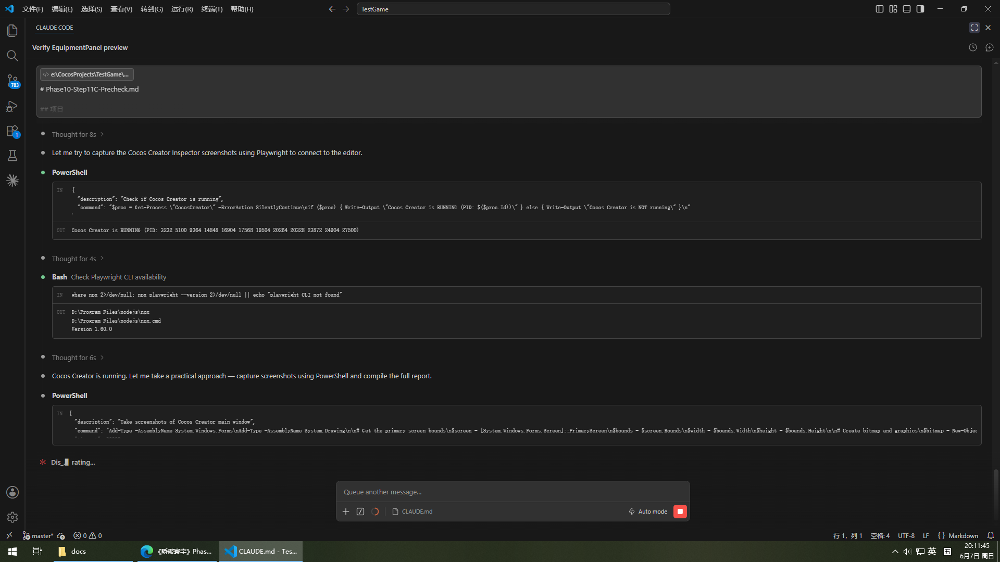

# Phase10-Step11C Precheck Report — Inspector Binding Recovery

**日期**: 2026-06-07  
**场景**: `assets/scenes/Phase8Main.scene`  
**分支**: master  
**状态**: 仅调查记录，禁止修复  

---

## 1. 总体结论

| 检查项 | EquipmentBagPanel | EquipmentDetailPanel |
|--------|-------------------|----------------------|
| Missing Script | ❌ 无 | ❌ 无 |
| Missing Asset | ❌ 无 | ❌ 无 |
| 节点树完整 | ✅ | ✅ |
| Prefab 存在 | ✅ | ✅ |
| Prefab 连接正确 | ⚠️ UUID 不一致 | ⚠️ 非 Prefab Instance |

---

## 2. EquipmentBagPanel — Scene 节点树

**场景路径**: Phase8Main.scene > Canvas > EquipmentBagPanel  
**节点 `_id`**: `75K1EGDDdB74/jxqltqfq8`  
**`_active`**: `false`  
**Prefab 引用**: `__id__ 138` → PrefabInfo asset UUID: `8aab8dc9-042c-40cc-b2db-2feca1ffdddd`

### 根节点组件

| 组件 ID | 类型 | 备注 |
|---------|------|------|
| 135 | `cc.UITransform` | |
| 136 | `fb89dlx4T5D+KqcbZ4IfpEl` | EquipmentBagPanel.ts (UUID: `fb89d971-e13e-43f8-aa9c-6d9e087e9125`) |
| 137 | `cc.Widget` | |

### 完整节点树

```
EquipmentBagPanel [active=false] [comps=UITransform, EquipmentBagPanel.ts, Widget]
└── panelRoot [active=true] [comps=UITransform, Sprite]
    ├── titleLabel [active=true] [comps=UITransform, Label]
    ├── filterHintLabel [active=true] [comps=UITransform, Label]
    ├── typeAllBtn [active=true] [comps=UITransform, Button, Label]
    ├── typeWeaponBtn [active=true] [comps=UITransform, Button, Label]
    ├── typeArmorBtn [active=true] [comps=UITransform, Button, Label]
    ├── typeAccessoryBtn [active=true] [comps=UITransform, Button, Label]
    ├── qualityAllBtn [active=true] [comps=UITransform, Button, Label]
    ├── qualityCommonBtn [active=true] [comps=UITransform, Button, Label]
    ├── qualityRareBtn [active=true] [comps=UITransform, Button, Label]
    ├── qualityEpicBtn [active=true] [comps=UITransform, Button, Label]
    ├── qualityLegendaryBtn [active=true] [comps=UITransform, Button, Label]
    ├── scrollView [active=true] [comps=UITransform, ScrollView]
    │   └── view [active=true] [comps=UITransform, Mask]
    │       └── contentNode [active=true] [comps=UITransform, Layout]
    ├── closeButton [active=true] [comps=UITransform, Button, Label]
    └── emptyHintNode [active=false] [comps=UITransform, Label]
```

> 注：所有子节点的 `_prefab.__uuid__` 均为 `f4d5e6a7-b8c9-0123-defa-234567890123`（EquipmentBagPanel.prefab UUID）。

---

## 3. EquipmentDetailPanel — Scene 节点树

**场景路径**: Phase8Main.scene > Canvas > EquipmentDetailPanel  
**节点 `_id`**: `EquipmentDetailPanel-root`  
**`_active`**: `false`  
**Prefab 引用**: `__uuid__: "b5995a61-fbb0-47a0-8ea6-f728a6314036"` (类型: `cc.SceneAsset`)

### 根节点组件

| 组件 ID | 类型 | 备注 |
|---------|------|------|
| 224 | `cc.UITransform` | |
| 225 | `534faGomxJErYQBMNA+oQCU` | EquipmentDetailPanel.ts (UUID: `534fa1a8-9b12-44ad-8401-30d03ea10094`) |
| 226 | `cc.Widget` | |

### 完整节点树

```
EquipmentDetailPanel [active=false] [comps=UITransform, EquipmentDetailPanel.ts, Widget]
└── panelRoot [active=true] [comps=UITransform, Sprite]
    ├── nameLabel [active=true] [comps=UITransform, Label]
    ├── qualityLabel [active=true] [comps=UITransform, Label]
    ├── levelLabel [active=true] [comps=UITransform, Label]
    ├── enhanceLevelLabel [active=false] [comps=UITransform, Label]
    ├── powerLabel [active=true] [comps=UITransform, Label]
    ├── hpStatLabel [active=true] [comps=UITransform, Label]
    ├── atkStatLabel [active=true] [comps=UITransform, Label]
    ├── defStatLabel [active=true] [comps=UITransform, Label]
    ├── equipStatusLabel [active=true] [comps=UITransform, Label]
    ├── equipBtn [active=true] [comps=UITransform, Button, Label]
    ├── unequipBtn [active=false] [comps=UITransform, Button, Label]
    ├── upgradeBtn [active=true] [comps=UITransform, Button, Label]
    ├── enhanceBtn [active=true] [comps=UITransform, Button, Label]
    ├── decomposeBtn [active=true] [comps=UITransform, Button, Label]
    ├── previewContainer [active=false] [comps=UITransform, Sprite]
    │   ├── previewPowerLabel [active=true] [comps=UITransform, Label]
    │   └── previewCostLabel [active=true] [comps=UITransform, Label]
    ├── confirmDialog [active=false] [comps=UITransform, Sprite]
    │   ├── confirmTextLabel [active=true] [comps=UITransform, Label]
    │   ├── confirmBtn [active=true] [comps=UITransform, Button, Label]
    │   └── cancelBtn [active=true] [comps=UITransform, Button, Label]
    ├── closeButton [active=true] [comps=UITransform, Button, Label]
    └── slotPickerContainer [active=false] [comps=UITransform, Sprite]
        └── slotPickerCloseBtn [active=true] [comps=UITransform, Button, Label]
```

---

## 4. Prefab 文件检查

### 4.1 EquipmentBagPanel.prefab

**文件**: `assets/prefabs/panels/EquipmentBagPanel.prefab`  
**Meta UUID**: `f4d5e6a7-b8c9-0123-defa-234567890123` (⚠️ 疑似占位 UUID)  
**大小**: 58,477 字符  
**备份**: `EquipmentBagPanel.prefab.backup.Step10M` (58,513 字符, **不一致**)

#### 根节点组件

| 组件 ID | 类型 |
|---------|------|
| 64 | `cc.UITransform` |
| 65 | `fb89dlx4T5D+KqcbZ4IfpEl` (EquipmentBagPanel.ts) |
| 66 | `cc.Widget` |
| 67 | `cc.PrefabInfo` |

#### 节点树 (与 Scene 一致)

```
EquipmentBagPanel [active=true]
└── panelRoot [active=true]
    ├── titleLabel
    ├── filterHintLabel
    ├── typeAllBtn (UITransform, Button, Label)
    ├── typeWeaponBtn (UITransform, Button, Label)
    ├── typeArmorBtn (UITransform, Button, Label)
    ├── typeAccessoryBtn (UITransform, Button, Label)
    ├── qualityAllBtn (UITransform, Button, Label)
    ├── qualityCommonBtn (UITransform, Button, Label)
    ├── qualityRareBtn (UITransform, Button, Label)
    ├── qualityEpicBtn (UITransform, Button, Label)
    ├── qualityLegendaryBtn (UITransform, Button, Label)
    ├── scrollView → view → contentNode
    ├── closeButton (UITransform, Button, Label)
    └── emptyHintNode (UITransform, Label, active=false)
```

**组件完整性**: 所有 Label 组件 `_string` / `_fontSize` 等属性完整  
**Missing Script**: ❌ 无  
**Missing Asset**: ❌ 无  

### 4.2 EquipmentDetailPanel.prefab

**文件**: `assets/prefabs/panels/EquipmentDetailPanel.prefab`  
**Meta UUID**: `a5e6f7b8-c9d0-1234-efab-345678901234` (⚠️ 疑似占位 UUID)  

#### 根节点组件

| 组件 ID | 类型 |
|---------|------|
| 2 | `cc.UITransform` (`_contentSize`: 720×1280) |
| 3 | `534faGomxJErYQBMNA+oQCU` (EquipmentDetailPanel.ts) |
| 4 | `cc.Widget` |

#### 节点树 (与 Scene 完全一致)

```
EquipmentDetailPanel [active=true]
└── panelRoot [active=true]
    ├── nameLabel
    ├── qualityLabel
    ├── levelLabel
    ├── enhanceLevelLabel [active=false]
    ├── powerLabel
    ├── hpStatLabel
    ├── atkStatLabel
    ├── defStatLabel
    ├── equipStatusLabel
    ├── equipBtn (UITransform, Button, Label)
    ├── unequipBtn [active=false] (UITransform, Button, Label)
    ├── upgradeBtn (UITransform, Button, Label)
    ├── enhanceBtn (UITransform, Button, Label)
    ├── decomposeBtn (UITransform, Button, Label)
    ├── previewContainer [active=false]
    │   ├── previewPowerLabel
    │   └── previewCostLabel
    ├── confirmDialog [active=false]
    │   ├── confirmTextLabel
    │   ├── confirmBtn
    │   └── cancelBtn
    ├── closeButton (UITransform, Button, Label)
    └── slotPickerContainer [active=false]
        └── slotPickerCloseBtn
```

**组件完整性**: 所有 Label/Button/Sprite 组件属性完整  
**Missing Script**: ❌ 无  
**Missing Asset**: ❌ 无  

---

## 5. UUID 与 Prefab 连接分析

### 5.1 关键 UUID 对照表

| 实体 | UUID | 备注 |
|------|------|------|
| Phase8Main.scene | `b5995a61-fbb0-47a0-8ea6-f728a6314036` | |
| EquipmentPanel.prefab | `8aab8dc9-042c-40cc-b2db-2feca1ffdddd` | 旧 Panel |
| EquipmentBagPanel.prefab (meta) | `f4d5e6a7-b8c9-0123-defa-234567890123` | ⚠️ 疑似占位 |
| EquipmentDetailPanel.prefab (meta) | `a5e6f7b8-c9d0-1234-efab-345678901234` | ⚠️ 疑似占位 |
| EquipmentBagPanel.ts | `fb89d971-e13e-43f8-aa9c-6d9e087e9125` | 压缩: `fb89dlx4T5D+KqcbZ4IfpEl` |
| EquipmentDetailPanel.ts | `534fa1a8-9b12-44ad-8401-30d03ea10094` | 压缩: `534faGomxJErYQBMNA+oQCU` |

### 5.2 EquipmentBagPanel Prefab 连接问题 ⚠️

Scene 中 EquipmentBagPanel 的 PrefabInfo (idx 138) 引用 asset UUID:

```
8aab8dc9-042c-40cc-b2db-2feca1ffdddd  →  EquipmentPanel.prefab (旧 Panel)
```

但是 EquipmentBagPanel 的 `.meta` UUID 是:

```
f4d5e6a7-b8c9-0123-defa-234567890123  →  EquipmentBagPanel.prefab
```

**结论**: Scene 根节点 PrefabInfo 指向了**旧的 EquipmentPanel.prefab**，而非 EquipmentBagPanel.prefab。子节点的 `_prefab.__uuid__` 均为 `f4d5e6a7`（正确），说明节点树内部一致但 Prefab 根链接可能不正确。

### 5.3 EquipmentDetailPanel Prefab 连接问题 ⚠️

Scene 中 EquipmentDetailPanel 的 `_prefab` 字段:

```json
{
  "__uuid__": "b5995a61-fbb0-47a0-8ea6-f728a6314036",
  "__expectedType__": "cc.SceneAsset"
}
```

该 UUID 是 **Phase8Main.scene 自身**的 UUID，类型为 `SceneAsset` 而非 `Prefab`。

**结论**: EquipmentDetailPanel 在 Scene 中是**嵌入式节点**，不是 Prefab Instance。在 Cocos Creator 中通过 Prefab 拖入场景时会自动建立 PrefabInstance 连接，但当前节点的 `_prefab` 字段指向的是场景本身，说明此节点可能是直接从 Prefab 复制节点树粘贴而来，或 Prefab 连接已丢失。

---

## 6. 资产清单

### 6.1 EquipmentBagPanel 使用的 Prefab

| Prefab | 路径 | 用途 |
|--------|------|------|
| EquipmentBagPanel.prefab | `assets/prefabs/panels/EquipmentBagPanel.prefab` | 背包面板本体 |
| EquipmentItemView.prefab | `assets/prefabs/items/EquipmentItemView.prefab` | 列表项（运行时动态生成） |

### 6.2 EquipmentBagPanel 使用的节点

| 节点名 | 用途 |
|--------|------|
| `panelRoot` | 面板容器 |
| `titleLabel` | 标题 "装备背包" |
| `filterHintLabel` | 筛选项提示 "全部类型 · 全部品质 · 0 件" |
| `typeAllBtn` | 筛选按钮: 全部 |
| `typeWeaponBtn` | 筛选按钮: 武器 |
| `typeArmorBtn` | 筛选按钮: 防具 |
| `typeAccessoryBtn` | 筛选按钮: 饰品 |
| `qualityAllBtn` | 品质筛选: 全部 |
| `qualityCommonBtn` | 品质筛选: 普通 |
| `qualityRareBtn` | 品质筛选: 稀有 |
| `qualityEpicBtn` | 品质筛选: 史诗 |
| `qualityLegendaryBtn` | 品质筛选: 传说 |
| `scrollView` / `view` / `contentNode` | 装备列表滚动区域 |
| `closeButton` | 关闭按钮 |
| `emptyHintNode` | 空状态提示 (默认隐藏) |

### 6.3 EquipmentDetailPanel 使用的 Prefab

| Prefab | 路径 | 用途 |
|--------|------|------|
| EquipmentDetailPanel.prefab | `assets/prefabs/panels/EquipmentDetailPanel.prefab` | 详情面板本体 |
| EquipmentSlotItem.prefab | `assets/prefabs/items/EquipmentSlotItem.prefab` | 槽位项（运行时动态生成） |

### 6.4 EquipmentDetailPanel 使用的节点

| 节点名 | 用途 |
|--------|------|
| `panelRoot` | 面板容器 |
| `nameLabel` | 装备名称 |
| `qualityLabel` | 品质标签 |
| `levelLabel` | 等级标签 |
| `enhanceLevelLabel` | 强化等级 (默认隐藏) |
| `powerLabel` | 战斗力标签 |
| `hpStatLabel` | 血量属性 |
| `atkStatLabel` | 攻击属性 |
| `defStatLabel` | 防御属性 |
| `equipStatusLabel` | 装配状态文字 |
| `equipBtn` | 装备按钮 |
| `unequipBtn` | 卸下按钮 (默认隐藏) |
| `upgradeBtn` | 升级按钮 |
| `enhanceBtn` | 强化按钮 |
| `decomposeBtn` | 分解按钮 |
| `previewContainer` | 预览容器 (默认隐藏) |
| `previewPowerLabel` | 预览战斗力差值 |
| `previewCostLabel` | 预览消耗显示 |
| `confirmDialog` | 确认对话框 (默认隐藏) |
| `confirmTextLabel` | 确认文本 |
| `confirmBtn` | 确认按钮 |
| `cancelBtn` | 取消按钮 |
| `closeButton` | 关闭按钮 |
| `slotPickerContainer` | 槽位选择器 (默认隐藏) |
| `slotPickerCloseBtn` | 槽位选择器关闭按钮 |

### 6.5 EquipmentItemView Prefab 节点结构

```
EquipmentItemView [active=true] [comps=UITransform, 70da1lot5xAuoOac7L+7ElM]
├── bgNode [comps=UITransform, Sprite]
├── qualityBarNode [comps=UITransform, Sprite]
├── nameLabel [comps=UITransform, Label]
├── qualityLabel [comps=UITransform, Label]
├── statsLabel [comps=UITransform, Label]
├── powerLabel [comps=UITransform, Label]
├── equippedBadgeNode [active=false] [comps=UITransform]
│   └── equippedLabel [comps=UITransform, Label]
└── clickButton [comps=UITransform, Button]
```

### 6.6 EquipmentSlotItem Prefab 节点结构

```
EquipmentSlotItem [active=true] [comps=UITransform, 1fb339TunNNsZp6x2v2jAaW]
├── borderNode [comps=UITransform, Sprite]
├── iconNode [comps=UITransform, Sprite]
├── slotNameLabel [comps=UITransform, Label]
├── equipmentNameLabel [comps=UITransform, Label]
├── statsLabel [comps=UITransform, Label]
├── qualityLabel [comps=UITransform, Label]
├── powerLabel [comps=UITransform, Label]
└── clickButton [comps=UITransform, Button]
```

---

## 7. Missing Script / Missing Asset 检查

### Scene 检查
- 搜索关键字 `Missing`, `missing`, `.comp` — **无匹配结果**
- 所有自定义组件 ID 已成功解析为对应的 TypeScript 脚本：
  - `fb89dlx4T5D+KqcbZ4IfpEl` → `EquipmentBagPanel.ts` ✅
  - `534faGomxJErYQBMNA+oQCU` → `EquipmentDetailPanel.ts` ✅

### Prefab 检查
- EquipmentBagPanel.prefab — **无 Missing Script / Missing Asset**
- EquipmentDetailPanel.prefab — **无 Missing Script / Missing Asset**
- EquipmentItemView.prefab — **无 Missing Script / Missing Asset**
- EquipmentSlotItem.prefab — **无 Missing Script / Missing Asset**

---

## 8. 截图

### 8.1 Cocos Creator 全屏截图



保存路径: `docs/Phase10-Step11C-CocosCreator-Screenshot.png`

### 8.2 需要在 Cocos Creator Editor 中手动截取的 Inspector 视图

由于 Inspector 面板截图需要交互式操作（选中对应节点、展开 Component 区域、查看 Property 区域），建议在 Cocos Creator 中进行以下手动截屏：

**EquipmentBagPanel Inspector**:
1. 打开 `Phase8Main.scene`
2. 在 Hierarchy 中选中 `Canvas > EquipmentBagPanel`
3. 截图 Inspector 面板，确保显示：
   - Node 属性区域（Position, Rotation, Scale, Layer 等）
   - EquipmentBagPanel 组件区域（脚本属性绑定）
   - Widget 组件区域
4. 保存为 `Phase10-Step11C-Inspector-EquipmentBagPanel.png`

**EquipmentDetailPanel Inspector**:
1. 在 Hierarchy 中选中 `Canvas > EquipmentDetailPanel`
2. 截图 Inspector 面板，确保显示：
   - Node 属性区域
   - EquipmentDetailPanel 组件区域（脚本属性绑定）
   - Widget 组件区域
3. 保存为 `Phase10-Step11C-Inspector-EquipmentDetailPanel.png`

---

## 9. 注意事项（供 Step11C 参考）

### 9.1 已知问题

1. **EquipmentBagPanel Scene PrefabInfo UUID 不一致**: Scene 中 PrefabInfo 引用 `8aab8dc9` (旧 EquipmentPanel)，而 Prefab meta UUID 为 `f4d5e6a7`。**Step11C 修复时需要更新 PrefabInfo 的 asset UUID**。

2. **EquipmentDetailPanel 非 Prefab Instance**: Scene 中 EquipmentDetailPanel 的 `_prefab` 字段类型为 `SceneAsset` 而非正确 Prefab 引用。**Step11C 可能需要通过 Cocos Creator 重新拖入 Prefab 建立连接**。

3. **Meta 文件 UUID 可疑**: `EquipmentBagPanel.prefab.meta` 和 `EquipmentDetailPanel.prefab.meta` 中的 UUID 均为形如 `f4d5e6a7-b8c9-0123-defa-234567890123` 的模式化 ID，可能是手动生成或测试数据。在 Step11C 修复后，Cocos Creator 会自动重新生成正确的 UUID。

4. **EquipmentBagPanel Prefab 备份不一致**: 当前 prefab (58,477 字符) 与备份 `backup.Step10M` (58,513 字符) 存在差异。Step11C 应基于当前版本进行。

### 9.2 禁止修改的文件

Step11C 禁止修改以下文件（本次 precheck 也已避免接触）:
- `EquipmentMediator.ts`
- `EquipmentUIPresenter.ts`
- `EquipmentService.ts`
- `InventoryService.ts`
- `SaveManager.ts`

### 9.3 需要绑定到 Inspector 的关键属性

基于 EquipmentBagPanel.ts 和 EquipmentDetailPanel.ts 的组件属性，Step11C 需要确保以下节点正确绑定：

**EquipmentBagPanel**:
- `panelRoot`, `titleLabel`, `filterHintLabel`
- `typeAllBtn`, `typeWeaponBtn`, `typeArmorBtn`, `typeAccessoryBtn`
- `qualityAllBtn`, `qualityCommonBtn`, `qualityRareBtn`, `qualityEpicBtn`, `qualityLegendaryBtn`
- `scrollView`, `contentNode`
- `closeButton`, `emptyHintNode`

**EquipmentDetailPanel**:
- `panelRoot`, `nameLabel`, `qualityLabel`, `levelLabel`, `enhanceLevelLabel`
- `powerLabel`, `hpStatLabel`, `atkStatLabel`, `defStatLabel`
- `equipStatusLabel`, `equipBtn`, `unequipBtn`, `upgradeBtn`, `enhanceBtn`, `decomposeBtn`
- `previewContainer`, `previewPowerLabel`, `previewCostLabel`
- `confirmDialog`, `confirmTextLabel`, `confirmBtn`, `cancelBtn`
- `closeButton`, `slotPickerContainer`, `slotPickerCloseBtn`

---

*报告生成时间: 2026-06-07 | 仅调查记录，无任何修复操作*
